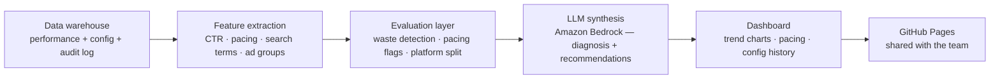

A large book of active campaigns. One team. Not enough hours to look at all of them properly.

The reviews that happened were symptom-driven — something had to go visibly wrong before it got attention. Everything else got a quick skim or nothing. Advertisers got inconsistent advice. Patterns that existed across campaigns were invisible because nobody was looking across campaigns.

The fix wasn't more headcount. It was a pipeline that runs every night whether anyone asks it to or not.

---

## What I built

Three layers, fully automated, no manual steps.

**Extraction and structuring** — fetches live campaign data from the data warehouse: performance, config, audit log. Computes the metrics that matter: CTR by search term, budget pacing, ad group performance, platform splits.

**Evaluation** — detects what's off. Budget waste in low-relevance search terms. Pacing inefficiencies. Underperforming ad groups. Platform imbalances. Deterministic, not probabilistic — the numbers are computed first, then flagged.

**Synthesis** — uses Amazon Bedrock (Claude) to turn the structured findings into narrative recommendations. Grounded in the numbers. In the right language for our market.

The output is an interactive dashboard: one view per campaign, with trend charts, hourly pacing curves, config change history, and a full written analysis. Every campaign. Every night.

---

## What it looks like in practice

A campaign running on a broad keyword match might be accumulating impressions from searches that share vocabulary with the product but have entirely different intent — a generic category term driving volume but generating near-zero clicks. Manually, you'd only catch this if you pulled the search term report and sorted by impression share.

The pipeline surfaces it automatically, flags it as waste, and generates a specific recommendation: add the term as a negative keyword, or switch to a positive keyword list if the platform supports it.

That's the intelligence layer: not just "here's the data" but detection (what's wrong), diagnosis (why), and prescription (what to do). The human reads the recommendation and acts. The human doesn't need to go looking for the problem first.

---

## What changed

**Coverage**: from partial, symptom-driven reviews to every campaign, every night.

**Quality**: recommendations can go deeper because the analytical groundwork is already done. Advertiser conversations start from insights rather than from data gathering.

**Visibility**: patterns that only emerge across campaigns became apparent — consistent waste on the same class of search terms showing up across multiple advertisers at once. That's only visible when you're looking at everything.

The quality floor went up because nothing gets skipped. Not because the ceiling got higher — because consistency replaced selection bias as the operating model.

---

## Honest limitations

Output quality depends on data quality upstream. Edge-case campaigns with unusual structures sometimes produce recommendations that need a closer human look before acting on. And as with any LLM synthesis layer, the narrative is only as good as the structured signal fed into it — the pipeline is designed so the numbers are computed deterministically first, and Claude handles interpretation, not calculation.

---

Fully headless — no browser, no manual steps. A scheduled job triggers it nightly. A 15-test end-to-end suite gates every deploy.

---

**Stack:** data warehouse SQL · Python · pandas → metric computation scripts · deterministic aggregation → Amazon Bedrock (Claude) → vanilla HTML/JS · GitHub Pages → Playwright E2E tests · automated QA gate
