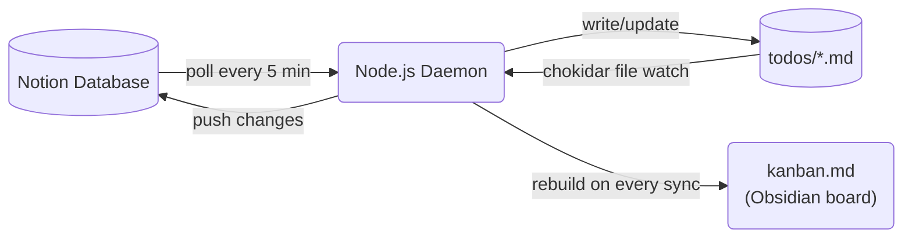

I use Notion as my task manager. I use Obsidian as my local knowledge base. For a long time I managed the gap manually — copying tasks, updating statuses in both places, letting them drift.

Eventually I got tired of it and built a sync daemon. It took a few weeks to get right, and on April 30, 2026, it wiped 28 tasks in under two seconds.

---

## The problem

Notion is great as a cockpit. Rich views, mobile app, sharing with others. But every task lives on a server. When I want to work offline, search with `grep`, or have Claude Code read my task list for context, Notion is opaque.

Obsidian is great as a local layer. Everything is plain text. It indexes instantly. You can build wikilinks, templates, kanban boards from files. But it has no mobile app worth using and no native connection to external databases.

I wanted both. Notion as the source of truth, a local folder of `.md` files that stays in sync, and an Obsidian kanban board for a drag-and-drop view over the same data.

---

## The architecture



The daemon does three things:

1. **Polls Notion** every 5 minutes for changes
2. **Watches the local folder** with chokidar — any `.md` file save triggers a push to Notion within 500 ms
3. **Rebuilds `kanban.md`** after every sync — a static file Obsidian renders as a kanban board

Each local file has YAML frontmatter mirroring the Notion page properties:

```markdown
---
notion_id: abc123...
status: In progress
horizon: Now
outcome:
category: work, project-x
last_synced_at: 2026-04-30T12:00:00.000Z
---

# Task title

Optional body that syncs to the Notion page body.

<!-- local: notes below this line are not synced to Notion -->
Private notes. Only visible locally.
```

It worked well for months. I stopped thinking of it as software I was building and started treating it as infrastructure I relied on.

That was the mistake.

---

## What broke

One morning I opened Obsidian and the kanban board was empty. I checked the `todos/` folder — files still there. I checked Notion — 28 tasks marked Done/Dropped. Some had been active for months.

The root cause took about an hour to find.

The Obsidian kanban plugin had rewritten `kanban.md` during a startup race. When Obsidian loads a kanban file, it re-serializes the board state. In this case it wrote a partially-initialized version with zero active cards.

The daemon had been watching `kanban.md` for status changes. It saw the rewritten file, parsed it, found zero active items, and concluded that every active task had been removed from the board. So it marked all of them as Done/Dropped in Notion and archived the local files.

The whole thing took about two seconds.

Three things had to go wrong at once:

1. **The kanban file was being read as input and written as output.** Generated files should never be treated as authoritative inputs.
2. **No limit on blast radius.** The daemon would happily apply a drop action to every single active task in one pass.
3. **No empty-file check.** A file with zero active items looked identical to "user deleted all tasks."

---

## The fixes

### 1. `kanban.md` is output-only

The kanban board is a projection of state — like a database view. Reading it back as an input is the same as writing a trigger that fires when a view is refreshed.

The fix: the daemon now explicitly excludes `kanban.md` from the file watcher. The file is clearly marked:

```
<!-- AUTO-GENERATED — do not edit. -->
```

Status changes still flow through the kanban — but by reading individual wikilink cards, not by inferring which tasks exist from the file as a whole. The source of truth for task existence is the JSON state file.

### 2. Empty-kanban guard

Before processing any drops, the daemon now checks its own state against what the kanban claims:

```js
if (kanbanFilenames.size === 0 && activeInState > 0) {
  log.warn('SAFETY: kanban has 0 active items but state has active items — skipping sync', {
    activeInState,
  });
  return;
}
```

If the kanban looks empty but the state knows about active tasks, the sync pass aborts and waits for the next poll.

### 3. Catastrophic-drop guard

Even with a non-empty kanban, a large batch of drops in one pass is treated as suspicious:

```js
if (dropActions.length > 5 && dropActions.length > kanbanFilenames.size) {
  log.warn('SAFETY: catastrophic drop detected — aborting drop pass', {
    dropCount: dropActions.length,
    boardSize: kanbanFilenames.size,
  });
  dropActions.length = 0;
}
```

More than 5 drops *and* more than 50% of the active board in one pass — abort. Status changes and new cards still go through. Only the mass-drop is blocked.

### 4. State backup and lockfile cleanup

Two smaller ones:

- **Rolling backup** — every state write copies the current file to `state.json.bak` first. Recovery is `cp state.json.bak state.json` and a restart.
- **Stale lockfile cleanup** — if the process crashes without releasing its lock, the next startup checks whether the PID is still alive before blocking. Dead PID means stale lock: clear it and continue.

---

## What it looks like now

The daemon has been running cleanly for several weeks. The guards have fired twice — both times Obsidian's startup race replicated the original condition. Both times, the sync suspended itself, logged a `SAFETY:` warning, and recovered on the next poll.

Two near-misses that didn't turn into wipeouts.

---

## A pattern worth naming

Looking back at this, each fix follows the same logic: every time the daemon made a mistake, I engineered a constraint that made that specific mistake impossible going forward. Not patching the logic — adding a structural rule.

I later came across a piece by Decoding AI on [agentic harness engineering](https://open.substack.com/pub/decodingaimagazine/p/agentic-harness-engineering) that puts it well:

> *"Harness engineering is the practice of engineering a solution every time an agent makes a mistake, ensuring it never makes that specific mistake again."*

That's exactly what these guards are. Worth keeping in mind for any automated process that takes real-world actions — not just the fancy LLM-powered kind.

---

## The code

The daemon is open-source: [github.com/waldov86/notion-obsidian-sync](https://github.com/waldov86/notion-obsidian-sync)

Node.js, ~1,000 lines across 8 files, zero cloud dependencies. Runs as a launchd agent on macOS or a systemd service on Linux. The README covers setup, configuration, and the Notion database schema you'll need.
