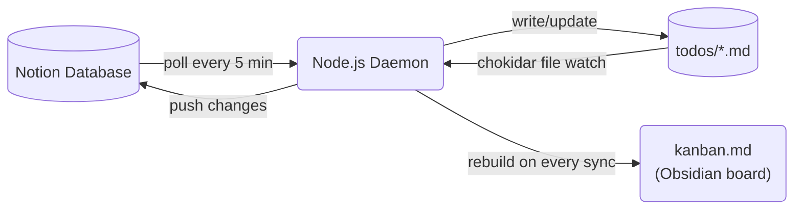

Notion is great. It's also exhausting. Every click goes through a server. The UI is busy. Opening it to check a task feels like loading a dashboard when all you wanted was a sticky note.

What I actually want day-to-day is simpler: a folder of plain text files I can open instantly, search with `grep`, scroll through in a terminal, or hand to Claude Code as context. Obsidian gives me that. It's fast, local, and gets out of the way.

But I can't ditch Notion entirely. Mobile access, quick capture on the go, sharing with others — for that it's still the right tool. I just don't want to *live* in it.

So I built a sync daemon. Notion stays as the source of truth and the mobile cockpit. Obsidian becomes the local view: a folder of `.md` files, one per task, plus a kanban board that mirrors the Notion database. You can work in either place and they stay in sync.

It took a few months to get right, and on April 30, 2026, it wiped 28 tasks in under two seconds.

## The architecture



The daemon does three things:

1. **Polls Notion** every 5 minutes for changes
2. **Watches the local folder** with chokidar — any `.md` file save triggers a push to Notion within 500 ms
3. **Rebuilds `kanban.md`** after every sync — a static file Obsidian renders as a kanban board

Each local file has YAML frontmatter mirroring the Notion page properties:

```markdown
---
notion_id: abc123...
status: In progress
horizon: Now
outcome:
category: work, project-x
last_synced_at: 2026-04-30T12:00:00.000Z
---

# Task title

Optional body that syncs to the Notion page body.

<!-- local: notes below this line are not synced to Notion -->
Private notes. Only visible locally.
```

It worked well for months. I stopped thinking of it as software I was building and started treating it as infrastructure I relied on.

That was the mistake.

---

## What broke

One morning I opened Obsidian and the kanban board was empty. I checked the `todos/` folder — files still there. I checked Notion — 28 tasks marked Done/Dropped. Some had been active for months.

The root cause took about an hour to find.

The Obsidian kanban plugin had rewritten `kanban.md` during a startup race. When Obsidian loads a kanban file, it re-serializes the board state. In this case it wrote a partially-initialized version with zero active cards.

The daemon had been watching `kanban.md` for status changes. It saw the rewritten file, parsed it, found zero active items, and concluded that every active task had been removed from the board. So it marked all of them as Done/Dropped in Notion and archived the local files.

The whole thing took about two seconds.

Three things had to go wrong at once:

1. **The kanban file was being read as input and written as output.** Generated files should never be treated as authoritative inputs.
2. **No limit on blast radius.** The daemon would happily apply a drop action to every single active task in one pass.
3. **No empty-file check.** A file with zero active items looked identical to "user deleted all tasks."

---

## The fixes

### 1. Separate the file watcher from the poll

`kanban.md` lives in the parent folder, not inside `todos/`, so it was never in the real-time chokidar watcher. The actual problem was a different kind of bidirectionality: the daemon was reading `kanban.md` to infer which tasks still existed, and any corrupted write — like the partially-initialized version Obsidian produced — would be treated as authoritative.

The fix has two parts. First, the source of truth for which tasks *exist* is now the JSON state file, not the kanban. The kanban is only read to detect column moves (status changes). Second, `kanban.md` is clearly marked so it's obvious it gets rebuilt automatically:

```
<!-- AUTO-GENERATED — do not edit. To change a task status, edit its status: field in todos/<filename>.md -->
```

Dragging a card between columns in Obsidian still syncs to Notion on the next poll — that bidirectional flow is intentional and working.

### 2. Empty-kanban guard

Before processing any drops, the daemon now checks its own state against what the kanban claims:

```js
if (kanbanFilenames.size === 0 && activeInState > 0) {
  log.warn('SAFETY: kanban has 0 active items but state has active items — skipping sync', {
    activeInState,
  });
  return;
}
```

If the kanban looks empty but the state knows about active tasks, the sync pass aborts and waits for the next poll.

### 3. Catastrophic-drop guard

Even with a non-empty kanban, a large batch of drops in one pass is treated as suspicious:

```js
if (dropActions.length > 5 && dropActions.length > kanbanFilenames.size) {
  log.warn('SAFETY: catastrophic drop detected — aborting drop pass', {
    dropCount: dropActions.length,
    boardSize: kanbanFilenames.size,
  });
  dropActions.length = 0;
}
```

More than 5 drops *and* more than 50% of the active board in one pass — abort. Status changes and new cards still go through. Only the mass-drop is blocked.

### 4. State backup and lockfile cleanup

Two smaller ones:

- **Rolling backup** — every state write copies the current file to `state.json.bak` first. Recovery is `cp state.json.bak state.json` and a restart.
- **Stale lockfile cleanup** — if the process crashes without releasing its lock, the next startup checks whether the PID is still alive before blocking. Dead PID means stale lock: clear it and continue.

---

## What it looks like now

- Open Notion on your phone, change a task status → within 5 minutes the local `.md` file reflects it and the kanban is rebuilt
- Edit a task body in Obsidian → within 500 ms the change is pushed to Notion
- Drop a new `.md` file in the folder → a Notion page is created, the file gets its `notion_id` back
- Drag a card to a different column in the Obsidian kanban → on the next poll the status syncs to Notion and the local file is updated
- Click a card in the kanban → it opens the linked `.md` file; edit the title or body there and it pushes to Notion within 500 ms

Each kanban card is a wikilink to its own `.md` file rather than a self-contained card. It mirrors how Notion works: the board is just a view, and the actual content lives in the page. You get drag-to-move for status changes and a full editor for everything else, without ever leaving Obsidian.

The safety guards have fired twice since the wipeout — both times Obsidian's startup race replicated the original condition. Both times the sync suspended itself, logged a `SAFETY:` warning, and recovered cleanly on the next poll.

---

## A pattern worth naming

Looking back at this, each fix follows the same logic: every time the daemon made a mistake, I engineered a constraint that made that specific mistake impossible going forward. Not patching the logic — adding a structural rule.

I later came across a piece by Decoding AI on [agentic harness engineering](https://open.substack.com/pub/decodingaimagazine/p/agentic-harness-engineering) that puts it well:

> *"Harness engineering is the practice of engineering a solution every time an agent makes a mistake, ensuring it never makes that specific mistake again."*

That's exactly what these guards are. Worth keeping in mind for any automated process that takes real-world actions — not just the fancy LLM-powered kind.

---

## One more thing: making it instant in both directions

After publishing this post I noticed one remaining asymmetry. Local edits push to Notion within 500 ms. But Notion changes — editing a task on mobile, say — only arrive locally on the next 5-minute poll.

The daemon has an HTTP trigger endpoint (`POST /trigger-poll`) for exactly this case. Send it a request and it runs an immediate poll instead of waiting for the interval. I'd wired up a Cloudflare Tunnel to expose it and built an n8n workflow to call it whenever Notion fires a change event — but left the workflow inactive and never tested it.

When I finally went to turn it on, I found the workflow had been built with a `responseMode: "immediately"` setting that n8n doesn't support. That's why it was returning 404 — it wasn't inactive, it was misconfigured. One field change, a workflow activation, and the chain was live.

I also added a concurrency guard before turning it on. The daemon's `poll()` is called from two places — the `setInterval` scheduler and the HTTP trigger handler — and neither had any protection against them running simultaneously. The fix is a module-level `pollInFlight` flag: whichever caller finds the flag set skips its run and logs a line. Eight lines of code, closes the whole surface.

The tested chain: Notion change event → n8n webhook → Cloudflare Tunnel → `POST /trigger-poll` → immediate poll → `kanban.md` rebuilt. Round-trip is a few seconds. Both directions are now effectively instant.

---

## The code

The daemon is open-source: [github.com/waldov86/notion-obsidian-sync](https://github.com/waldov86/notion-obsidian-sync)

Node.js, ~1,100 lines across 10 files, zero cloud dependencies. Runs as a launchd agent on macOS or a systemd service on Linux. The README covers setup, configuration, and the Notion database schema you'll need.
