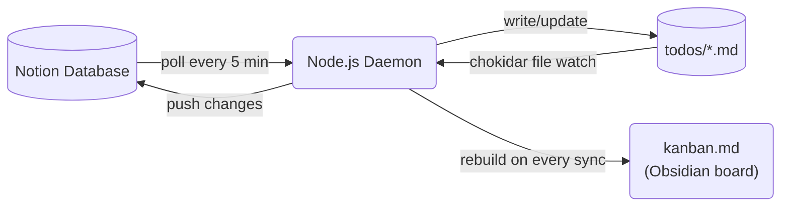

I use Notion as my task manager. I use Obsidian as my local knowledge base. For a long time I managed the gap manually — copying tasks, updating statuses in both places, letting them drift.

Eventually I got tired of it and built a sync daemon. It took a few months to get right, and on April 30, 2026, it wiped 28 tasks in under two seconds. This is about what broke, why, and what I built afterward to prevent it from ever happening again.

---

## The problem I was trying to solve

Notion is great as a cockpit. Rich views, mobile app, sharing with collaborators. But every task lives on a server. When I want to work offline, search with `grep`, or have Claude Code read my current task list to give context-aware help, Notion is opaque.

Obsidian is great as a local layer. Everything is plain text. It indexes instantly. You can build wikilinks, templates, kanban boards from files. But it has no mobile app worth using, and no native integration with external databases.

I wanted both. Notion as the source of truth for task management, a local folder of `.md` files that stays in sync, and an Obsidian kanban board that gives me a drag-and-drop view over the same data.

---

## The architecture



The daemon does three things simultaneously:

1. **Polls Notion** every 5 minutes for changes (any page in status `Backlog` or `In progress`)
2. **Watches the local folder** with chokidar — any `.md` file save triggers a push to Notion within 500 ms
3. **Rebuilds `kanban.md`** after every sync pass — a static output file Obsidian renders as a kanban board

Each local file has YAML frontmatter that mirrors the Notion page properties:

```markdown
---
notion_id: abc123...
status: In progress
horizon: Now
outcome:
category: work, project-x
last_synced_at: 2026-04-30T12:00:00.000Z
---

# Task title

Optional body that syncs to the Notion page body.

<!-- local: notes below this line are not synced to Notion -->
Private notes. Only visible locally.
```

State is stored in a JSON file — a map of Notion page IDs to local file paths, content hashes, and sync status. SHA-256 hashes of the synced fields let the daemon skip unnecessary pushes.

---

## What broke: the wipeout of April 30, 2026

I had been running this for a few months without major issues. Then one morning I opened Obsidian and noticed the kanban board was empty. I checked the `todos/` folder — still had files. I checked Notion — 28 tasks were marked Done/Dropped. Some had been active for months.

The root cause took about an hour to find.

The Obsidian kanban plugin had rewritten `kanban.md` during a startup race. When Obsidian loads a kanban file, it re-serializes the board state. In this case, it wrote a partially-initialized version with zero active cards.

The daemon had been watching `kanban.md` for status changes. It saw the rewritten file, parsed it, found zero active items, and concluded that every active task had been removed from the board. So it marked all of them as Done/Dropped in Notion and archived the local files.

The whole thing took about two seconds.

There were three independent failures that had to all line up:

1. **The kanban file was bidirectional**. It was both an output (written by the daemon) and an input (read by the daemon for status changes). Generated files should never be treated as inputs.
2. **No blast-radius limit**. The daemon would happily apply a drop action to every single active task in one pass. There was no sanity check on scale.
3. **No empty-file guard**. Parsing a file with zero active items was indistinguishable from "user deleted all tasks." It should have been treated as a corrupted state instead.

---

## The fixes

### 1. Make `kanban.md` output-only

The kanban board is now clearly marked as output-only:

```
<!-- AUTO-GENERATED — do not edit. To change a task status, edit its status: field in the .md file -->
```

Status changes still flow from the kanban board — but only from `.md` wikilink cards, never from the file's presence or absence on disk. The daemon reads the kanban only to detect drag-and-drop moves between columns, not to infer which tasks exist.

The "source of truth" for which tasks exist is the JSON state file, not the kanban.

### 2. The empty-kanban guard

Before processing any status changes or drops from the kanban, the daemon checks:

```js
if (kanbanFilenames.size === 0 && activeInState > 0) {
  log.warn('SAFETY: kanban has 0 active items but state has active items — skipping sync to avoid wipeout', {
    activeInState,
  });
  return;
}
```

If the kanban appears empty but the state knows about active tasks, the whole sync pass is aborted. The next poll will either see a properly-rendered kanban or trigger the guard again until the issue resolves.

### 3. The catastrophic-drop guard

Even if the kanban isn't empty, a large batch of drops in one pass is treated as suspicious:

```js
if (dropActions.length > 5 && dropActions.length > kanbanFilenames.size) {
  log.warn('SAFETY: catastrophic drop detected — aborting drop pass', {
    dropCount: dropActions.length,
    boardSize: kanbanFilenames.size,
    activeInState,
  });
  dropActions.length = 0;
}
```

The threshold is: more than 5 drops *and* more than 50% of the active board in one pass. Status changes and new cards still go through — only the mass-drop is blocked. This preserves normal operation while stopping the worst-case scenario.

### 4. State backup and lockfile cleanup

Two smaller hardening changes:

- **Rolling state backup**: every `saveState()` call copies the current state to `state.json.bak` before overwriting. Manual recovery is `cp state.json.bak state.json`.
- **Stale lockfile cleanup**: if the process crashes without releasing the lockfile, the next startup checks the PID in the lockfile. If that process is no longer alive, the stale lock is cleared rather than blocking startup forever.

---

## The architectural lesson

The wipeout happened because I treated `kanban.md` as bidirectional when it was structurally unidirectional.

The kanban board is a *projection* of the state. It's like a materialized view in a database — computed from the source, not the source itself. Reading it as input is the same as writing a database trigger that fires when a view is refreshed.

There's a general pattern here: whenever you have a file that's auto-generated by a process, make it physically impossible for that same process to read it back as authoritative input. Put it in a different directory, give it a different naming convention, or add a header that makes its generated nature obvious — and then enforce that at the parsing layer.

In this case, the fix was structural: the daemon now tracks which file is the kanban output path and explicitly excludes it from the file watcher.

---

## What it looks like now

After the fixes, the daemon has been running cleanly for several weeks. Typical flow:

- I open Notion on my phone and change a task's status → within 5 minutes, the local `.md` file reflects the change and the kanban board is rebuilt
- I edit a task body in Obsidian → within 500 ms, the change is pushed to Notion
- I drop a new `.md` file in the folder with just a title → within a second, a Notion page is created and the file gets its `notion_id` back

The safety guards have fired twice since deployment — both times because Obsidian's startup race replicated the original condition. Both times, the kanban showed zero items, the guard logged a `SAFETY:` warning, and the sync was suspended until the next poll when the kanban had rendered correctly.

---

## The code

The daemon is open-source: [github.com/waldov86/notion-obsidian-sync](https://github.com/waldov86/notion-obsidian-sync)

It's a Node.js script (~1,000 lines across 8 files), zero cloud dependencies, runs as a launchd agent on macOS or a systemd service on Linux. The README has setup instructions, a full configuration reference, and the Notion database schema you'll need.

If you've been managing Notion and Obsidian separately and want them to stay in sync without a third-party tool, it might save you some time — or at least the two seconds it took me to lose 28 tasks.
