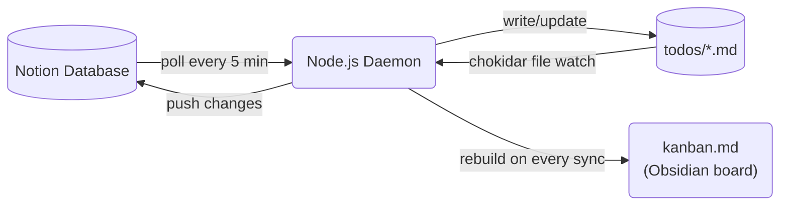

I use Notion as my task manager. I use Obsidian as my local knowledge base. For a long time I managed the gap manually — copying tasks, updating statuses in both places, letting them drift.

Eventually I got tired of it and built a sync daemon. It took a few months to get right, and on April 30, 2026, it wiped 28 tasks in under two seconds.

That incident didn't just teach me how to build a safer sync daemon. It gave me a concrete, visceral understanding of what an agent harness is — and why the harness matters more than the intelligence inside it.

---

## The problem I was trying to solve

Notion is great as a cockpit. Rich views, mobile app, sharing with collaborators. But every task lives on a server. When I want to work offline, search with `grep`, or have Claude Code read my current task list to give context-aware help, Notion is opaque.

Obsidian is great as a local layer. Everything is plain text. It indexes instantly. You can build wikilinks, templates, kanban boards from files. But it has no mobile app worth using, and no native integration with external databases.

I wanted both. Notion as the source of truth for task management, a local folder of `.md` files that stays in sync, and an Obsidian kanban board that gives me a drag-and-drop view over the same data.

---

## The architecture



The daemon does three things simultaneously:

1. **Polls Notion** every 5 minutes for changes (any page in status `Backlog` or `In progress`)
2. **Watches the local folder** with chokidar — any `.md` file save triggers a push to Notion within 500 ms
3. **Rebuilds `kanban.md`** after every sync pass — a static output file Obsidian renders as a kanban board

Each local file has YAML frontmatter that mirrors the Notion page properties:

```markdown
---
notion_id: abc123...
status: In progress
horizon: Now
outcome:
category: work, project-x
last_synced_at: 2026-04-30T12:00:00.000Z
---

# Task title

Optional body that syncs to the Notion page body.

<!-- local: notes below this line are not synced to Notion -->
Private notes. Only visible locally.
```

State is stored in a JSON file — a map of Notion page IDs to local file paths, content hashes, and sync status. SHA-256 hashes of the synced fields let the daemon skip unnecessary pushes.

It worked well for months. I stopped thinking of it as software I was building and started treating it as infrastructure I relied on.

That was the mistake.

---

## What broke: the wipeout of April 30, 2026

One morning I opened Obsidian and noticed the kanban board was empty. I checked the `todos/` folder — still had files. I checked Notion — 28 tasks were marked Done/Dropped. Some had been active for months.

The root cause took about an hour to find.

The Obsidian kanban plugin had rewritten `kanban.md` during a startup race. When Obsidian loads a kanban file, it re-serializes the board state. In this case, it wrote a partially-initialized version with zero active cards.

The daemon had been watching `kanban.md` for status changes. It saw the rewritten file, parsed it, found zero active items, and concluded that every active task had been removed from the board. So it marked all of them as Done/Dropped in Notion and archived the local files.

The whole thing took about two seconds.

There were three independent failures that had to all line up:

1. **The kanban file was bidirectional**. It was both an output (written by the daemon) and an input (read by the daemon for status changes). Generated files should never be treated as inputs.
2. **No blast-radius limit**. The daemon would happily apply a drop action to every single active task in one pass. There was no sanity check on scale.
3. **No empty-file guard**. Parsing a file with zero active items was indistinguishable from "user deleted all tasks." It should have been treated as corrupted state instead.

---

## This is what agents without harnesses do

After recovering the tasks (state backup, bless), I read a piece by Decoding AI on [agentic harness engineering](https://open.substack.com/pub/decodingaimagazine/p/agentic-harness-engineering) that reframed the whole incident for me.

The article's definition hit hard:

> *"Harness engineering is the practice of engineering a solution every time an agent makes a mistake, ensuring it never makes that specific mistake again."*

My sync daemon is an agent. Not a glamorous LLM-powered one — just a Node.js process that observes its environment, makes decisions, and takes actions with real-world consequences. It reads files, compares state, calls an API, writes to disk. That's the loop.

The diagram below is how I'd been thinking about AI agents — but looking at it after the wipeout, I realised it describes my daemon just as well.

**Agent = Model (intelligence) + Harness (everything else)**

The harness is the infrastructure that surrounds the decision-making logic: the tools it can use, the memory it draws on, the sandbox constraints, the orchestration layer, the circuit breakers. The model — whether that's a neural net or a deterministic state machine — is only as safe as its harness allows it to be.

My daemon had a model (the sync logic) and zero harness. No bounds on what a single decision could affect. No memory about which files it generated vs. which files it should read. No sandbox preventing a corrupted input from triggering a write to every record in the database.

The wipeout was inevitable. The only question was when.

---

## Building the harness

Fixing the daemon meant building the harness it should have had from the start.

### Guard 1: output files are not inputs

The kanban board is a *projection* of state — like a materialized database view. Reading it back as authoritative input is the same as writing a trigger that fires when a view is refreshed.

The fix was structural: the daemon now explicitly excludes `kanban.md` from the file watcher and tracks the output path in config to enforce this at multiple layers. The file is clearly marked:

```
<!-- AUTO-GENERATED — do not edit. -->
```

Status changes still flow *through* the kanban board — but by reading individual wikilink cards, not by inferring task existence from the file. The source of truth for which tasks exist is the JSON state file, not the kanban.

### Guard 2: the empty-kanban check

Before processing any drops from the kanban, the daemon now checks its own state against what the kanban claims:

```js
if (kanbanFilenames.size === 0 && activeInState > 0) {
  log.warn('SAFETY: kanban has 0 active items but state has active items — skipping sync', {
    activeInState,
  });
  return;
}
```

If the kanban appears empty but the state knows about active tasks, the sync pass aborts. This is the harness saying: *the model's input looks wrong — refuse to act until it doesn't*.

### Guard 3: the catastrophic-drop limit

Even with a non-empty kanban, mass drops are treated as suspicious:

```js
if (dropActions.length > 5 && dropActions.length > kanbanFilenames.size) {
  log.warn('SAFETY: catastrophic drop detected — aborting drop pass', {
    dropCount: dropActions.length,
    boardSize: kanbanFilenames.size,
  });
  dropActions.length = 0;
}
```

More than 5 drops *and* more than 50% of the active board in one pass — abort. Status changes and new cards still process. Only the mass-drop is blocked. This is blast-radius limiting: the model can act, but only up to the point where the consequences become irreversible at scale.

### Guard 4: memory and recovery

Two smaller changes that matter when things still go wrong:

- **Rolling state backup** — every write copies the current state to `state.json.bak` before overwriting. Recovery is `cp state.json.bak state.json` and a restart.
- **Stale lockfile cleanup** — if the process crashes without releasing its lockfile, the next startup checks whether the PID is still alive before blocking. A dead PID means a stale lock: clear it and continue.

These aren't prevention — they're recovery paths. A complete harness has both.

---

## The pattern generalises

The thing about harness engineering is that it's not really about the specific mistake. It's about a discipline: every time your agent does something wrong, you don't just fix the logic — you add a constraint that makes that class of mistake structurally impossible going forward.

The mistake my daemon made was: treating a generated file as authoritative input. The harness fix was: the file watcher now has an explicit exclusion list and the kanban path is always on it. That constraint exists forever, regardless of what else changes in the code.

This is very different from patching the logic. Patching logic creates a new version that probably won't make the same mistake. Adding a harness constraint creates a system that *cannot* make that mistake, regardless of what the logic does.

I've started applying this frame to every automated process I build. Not just "does the code look right?" but "what's the worst thing this agent could do unilaterally, and what harness constraint would make that impossible?"

---

## What it looks like now

The daemon has been running cleanly for several weeks. Typical flow:

- I open Notion on my phone and change a task's status → within 5 minutes, the local `.md` file reflects the change and the kanban board is rebuilt
- I edit a task body in Obsidian → within 500 ms, the change is pushed to Notion
- I drop a new `.md` file in the folder with just a title → within a second, a Notion page is created and the file gets its `notion_id` back

The safety guards have fired twice since deployment — both times because Obsidian's startup race replicated the original condition. Both times, the kanban showed zero items, the guard logged a `SAFETY:` warning, and the sync was suspended until the next poll when the kanban had rendered correctly.

Two false alarms that didn't become two more wipeouts. That's the harness working.

---

## The code

The daemon is open-source: [github.com/waldov86/notion-obsidian-sync](https://github.com/waldov86/notion-obsidian-sync)

Node.js, ~1,000 lines across 8 files, zero cloud dependencies. Runs as a launchd agent on macOS or a systemd service on Linux. The README covers setup, configuration, and the Notion database schema.

If you've built something like this — or you're building agents of any kind and wondering why the harness deserves as much attention as the model — the Decoding AI piece on [agentic harness engineering](https://open.substack.com/pub/decodingaimagazine/p/agentic-harness-engineering) is worth reading. It gave me the vocabulary for something I'd been learning the hard way.
