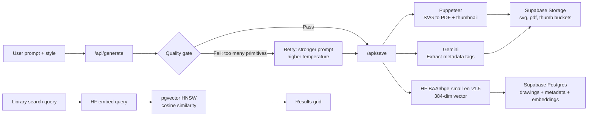

**[robot-cooks-drawings.netlify.app](https://robot-cooks-drawings.netlify.app/)** — a web app that generates printable A4 coloring pages for kids. Describe a scene, pick a style, get a PDF in under a minute.

She wanted a coloring page of a dragon learning to cook pasta. Not a generic dragon — *this specific dragon*, in an apron, at a stove, with pasta. Nothing like that existed anywhere. So I said I'd make one.

She named it too. She saw the little robot in the app and announced it was a cook. Robot Cooks Drawings. Non-negotiable.

What started as a quick one-off became a proper project, because the gap between "generate a drawing" and "actually hand it to a kid, printed" is bigger than it looks. The quality has to be right. The file has to be the right format. The lines have to be thick enough for small hands with crayons. And if you make ten drawings over a week, you want to find the good ones again.

That gap — between the simple output and the pipeline behind it — is what this project is really about.

---

## How it works

1. You describe a scene in plain text — *"a friendly bear in a library wearing reading glasses."*
2. You pick a style: Classic Coloring, Cartoon Story, or Magic Dots (connect-the-dots).
3. The app calls Gemini, which generates a structured SVG at A4 dimensions.
4. Before anything is saved, the SVG goes through a quality check. If the model drew stick figures instead of proper cartoon shapes, it retries automatically with a stronger prompt.
5. The SVG is converted to a PDF, a thumbnail is generated, metadata tags are extracted, and everything is embedded into a vector and saved to Supabase.
6. You download the PDF and print it.

There's also a browsable library where you can search by text — "animals," "space," "food" — using semantic similarity rather than exact keyword matching.

---



---

## ⚙️ The engineering behind "just print this"

### The SVG quality gate

The first version trusted whatever the model returned. That was a mistake. Gemini — like most LLMs given an SVG task — defaults to the path of least resistance: `<ellipse>` for heads, `<rect>` for torsos, `<line>` everywhere. The result looks like a geometry diagram, not something a kid would want to color.

The fix is a quality gate that runs after every generation. It counts `<path>` elements vs geometric primitives:

```js
const pathCount    = (svg.match(/<path\b/gi)    ?? []).length;
const ellipseCount = (svg.match(/<ellipse\b/gi) ?? []).length;
const rectCount    = (svg.match(/<rect\b/gi)    ?? []).length;

const primitiveDominated = rectCount + ellipseCount > pathCount;
const tooFewPaths        = pathCount < 10;
```

If it fails, it retries at higher temperature (0.6 vs 0.4) with an explicit correction: *"The previous attempt produced stick-figure output. This time you MUST draw the characters with smooth organic Bezier curves using `<path>` elements with C/Q commands."*

The second attempt passes around 90% of the time. Every saved drawing was actually good enough.

### Multi-model fallback

The app doesn't hardcode a single Gemini model. At startup it calls the Gemini ListModels endpoint to get whatever models are actually available, then tries them in ranked order from best to worst. If all Gemini models fail, it falls back to Groq. The app keeps working even when Gemini deprecates a model or rate-limits the free tier.

### The save pipeline

After a drawing passes the quality gate, five things happen before anything is stored:

```
SVG input
 ├─ Puppeteer renders → PDF (A4, 300dpi)
 ├─ Puppeteer renders → PNG thumbnail (400px wide)
 └─ Gemini reads SVG → JSON tags (objects, scene summary, style complexity)
     └─ HF BAAI/bge-small-en-v1.5 embeds the tag text → 384-dim vector
         └─ Supabase: 3 storage buckets + 3 Postgres rows
            (drawings, drawing_metadata, drawing_embeddings)
```

Storage buckets are private — downloads use short-lived signed URLs generated server-side.

### Semantic search

When you type *"two animals in a forest,"* that query is embedded with the same Hugging Face model used at save time, producing a 384-dimensional vector. That vector is compared against every saved drawing's embedding using cosine similarity via pgvector's HNSW index:

```sql
SELECT d.*, 1 - (de.embedding <=> query_embedding) AS similarity
FROM drawings d
  JOIN drawing_embeddings de ON de.drawing_id = d.id
  LEFT JOIN drawing_metadata dm ON dm.drawing_id = d.id
ORDER BY de.embedding <=> query_embedding
LIMIT 20;
```

HNSW works at any dataset size. IVFFLAT doesn't — it needs at least 100 rows before the index is useful.

---

## 🎨 Drawing styles

Three styles, each with different SVG generation rules:

- **Classic Coloring** — bold outlines (1.5mm stroke), organic Bezier paths for characters, full background scene with ground and sky, regions large enough for crayons.
- **Cartoon Story** — expressive characters, lighter touch, storybook illustration aesthetic.
- **Magic Dots** — connect-the-dots. 20–30 numbered dots placed along the subject contour, sequential labels, optional faint background.

Forbidden elements across all styles: `<ellipse>`, `<line>`, `<polyline>`, gradients, inline styles, shading.

---

## 🤖 The robot drawing character

While generation runs, a custom SVG animation plays — a small robot sitting at a drawing board, pencil arm swinging back and forth, antenna pulsing orange, eye blinking every 3.2 seconds. Every animation is defined in keyframes inside the SVG `<style>` block. No external libraries. About 120 lines of SVG.

It's a small thing. It makes the wait feel like something is actually happening, which it is.

---

**Built with:** Next.js 14 (App Router) → Netlify → Google Gemini API (multi-model fallback) → Groq fallback → Supabase Postgres + pgvector → Hugging Face BAAI/bge-small-en-v1.5 → Puppeteer + @sparticuz/chromium → Tailwind CSS
