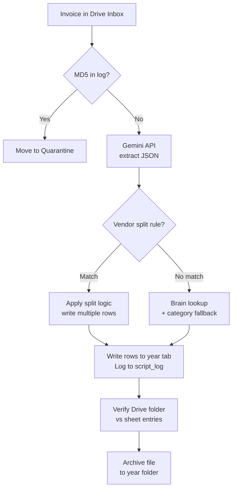

I had a working Google Apps Script that processed my tax invoices. It used Gemini directly — upload a PDF, get JSON back, write a row to the sheet. It worked. But it kept breaking in new ways, and every time I opened it to fix something, I lost track of what had changed and why.

This is about switching from that "chat with Gemini to patch the script" workflow to building with Claude Code — and what that actually changes.

---

## 🗂️ Before: Gemini in the loop, me in the middle

The original setup called Gemini from a browser chat window or the Apps Script editor. I'd describe a problem, get a function rewrite, paste it in, run it, repeat. It worked fine for isolated fixes but fell apart across sessions — by version three, I'd explain the same architectural decisions over and over because nothing was in context.

More importantly: to test anything, I had to point it at real invoice data. Real vendor names, real amounts, real files in Google Drive. Every iteration of the script had full access to everything.

---

## 🔒 The privacy shift: Claude Code in read-only mode

When I switched to Claude Code, the first thing I configured was **read-only mode**. Claude Code can be given granular tool permissions — I allowed it to read files and search the codebase, but not write to Drive, not send API calls on my behalf, not touch the spreadsheet.

This matters because the script processes real financial documents. I wanted an AI collaborator that could understand the full codebase — including the folder IDs, the sheet structure, the split logic — without being able to act on any of it autonomously. Read-only meant I could open the whole project without second-guessing what it might touch.

The other consideration was **MCP (Model Context Protocol)**. Claude Code supports MCP servers that give it access to external tools — Google Drive, Sheets, web search. I deliberately didn't connect those for this project. The script already had production credentials baked into `CONFIG`. Adding an MCP layer that could read or write those resources would have blurred the line between "AI understanding the code" and "AI with access to my data." For a tax automation touching real invoices, that line matters.

---

## 🤖 What actually changed

The biggest shift wasn't the model — it was context persistence. Claude Code reads the files. Not what I paste: the actual project, in full. When I said "add duplicate detection," it looked at how the log sheet was structured, found where MD5 hashes would naturally live, and wrote detection logic that fit the existing pattern. I didn't explain the architecture. It was already there.

That changes the unit of work. Instead of "fix this function," I could say "there's a problem with how we handle vendors that have multiple invoices in the same batch run" — and get a solution that understood what "batch run" meant in this specific script.

---

## 🔢 v1 to v7 — what each version actually added

### v1 — Get the basics working

Single Gemini call, hardcoded model, no error handling. PDF goes in, JSON comes out, a row gets written to the spreadsheet. Works about 70% of the time. The other 30% requires manual cleanup.

The prompt was straightforward: *"You are an expert accountant. Return JSON with vendor, date, amount, taxRate, description, category."*

### v2 — Handle the model being unavailable

Gemini was returning 503s intermittently. Instead of a hardcoded model ID, v2 queries the Gemini ListModels endpoint at runtime, gets back whatever models are actually available, and tries them in ranked order. Same pattern ended up in the coloring page project later — once you build it once, you reuse it.

### v3 — MD5 duplicate detection

The same invoice file occasionally ended up in the inbox twice — forwarded from two different email accounts, or re-downloaded after a portal update. Every processed file's MD5 hash now gets written to the `script_log` tab. On the next run, any file whose checksum already exists is moved to a Quarantine folder.

```js
const md5 = getMD5(file);
if (existingMD5s.has(md5)) {
  safeMoveFile(file, CONFIG.QUARANTINE_FOLDER_ID);
  logAction(logSheet, { ..., error: "Duplicate File" });
  continue;
}
existingMD5s.add(md5); // claim immediately so same-run duplicates are also caught
```

The "claim immediately" detail matters — without it, two identical files in the same inbox batch would both be processed before the first one's hash was written.

### v4 — Vendor split rules

Some recurring vendors needed custom logic that no generic AI prompt could handle reliably — bills that map to multiple expense categories, or invoices where only a percentage is deductible. A single PDF might need to produce two rows in the spreadsheet with different categories and amounts.

These aren't heuristics — they're deterministic rules in `applyVendorSplitLogic()`. The AI extracts the data; the rules decide what rows to write.

### v5 — The self-learning brain

The categorization step kept making the same mistakes. The same vendor would get filed under different categories run to run depending on the model's mood.

The brain reads the entire history of the spreadsheet before each run — every description, every vendor, every category decision that was ever made and kept — and builds a lookup table. It's a fallback, not an override: if the AI returns a valid category, that wins.

```js
// Brain is only a fallback — trust AI category first
if (!finalCategory) {
  const brainMatch = Object.keys(brain.rules).find(
    k => descriptionKey.includes(k) || vendorKey.includes(k)
  );
  if (brainMatch) finalCategory = brain.rules[brainMatch];
}
if (!finalCategory) finalCategory = validCategories[0];
```

Over time, as you keep the AI's decisions in the sheet, the brain's coverage grows. Self-improving without any explicit training step.

### v6 — Unified quarantine + full audit trail

Before v6, any error left the file in the inbox and printed a console message I'd probably miss. v6 added a unified quarantine — duplicates, AI failures, unknown years all go there. One folder I check once a week.

The `script_log` tab got a full audit trail at the same time: timestamp, year, amount, vendor + description, category, invoice number, MD5 hash, error message. Every run is fully inspectable without opening a single file.

### v7 — File verification after every run

After processing, the script checks that the Drive folder actually matches the spreadsheet. For each row in the year tab, it looks up the invoice number in the archive folder. If a file is missing, the "Invoice Drive check" column flags red.

This caught a real edge case: a file had been moved to quarantine after its row was already written — the row existed with a reference pointing to nothing. The verification step keeps both in sync.

---



---

## 💡 The moment where it felt different

There was a session where I asked Claude Code to fix the year routing logic — the part that decides which archive folder to move a file to based on the invoice date. I'd been handling it with a chain of `if (year === 2026)... else if (year === 2025)...` that would silently fail for any new year.

Claude Code looked at the existing `FOLDER_MAPPING` config — a dictionary of sheet IDs to folder IDs I'd already built for the file verification step — and suggested routing year decisions through that same config rather than duplicating the logic. I hadn't connected those two pieces. It did, because it could see both at once.

That's a different kind of collaboration than paste-and-ask. It's closer to pair programming with someone who has actually read your code.

---

## 📝 What I actually learned

**Start with a hard rule, not an AI decision.** Every time I reached for the model to make a categorization call, I eventually replaced it with a deterministic rule. The AI is good at extraction — reading an invoice and returning structured data. It's unreliable for decisions that have a correct answer I could just encode.

**The audit trail is the product.** The `script_log` tab started as a debug tool. It became the thing I actually check. Every decision the script made is there — including why something went to quarantine. That's more useful than the automation itself.

**Read-only mode is the right default.** Letting an AI read everything while acting on nothing is a comfortable working posture for anything touching real data. It's worth setting up explicitly rather than assuming it.

**Building something that iterates is faster than building something perfect.** v1 was embarrassingly simple. v7 handles edge cases I didn't know existed when I started. I didn't design for v7 — I got there one version at a time.

---

## → If you want the technical detail

The full script — source code, configuration, and a walkthrough of each function — is on the [AI Invoice Automation project page](/projects/ai-invoice-automation).
