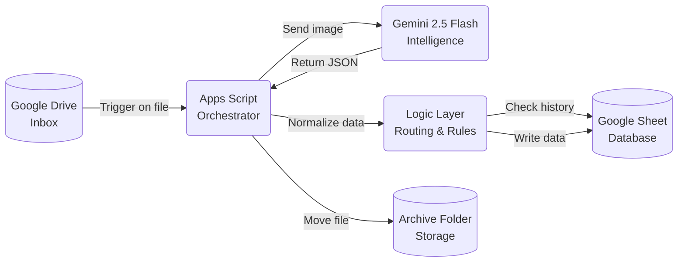

A self-learning automated pipeline that processes German tax invoices for €0/month. It replaces manual data entry by connecting Google Drive directly to Gemini's multimodal AI.

Drop a PDF into an inbox folder. A few seconds later, the vendor, date, amount, and category are in your tax spreadsheet. The file is archived to the right year folder. You never touch it.

---

## Key features

**Zero-cost architecture** — runs entirely on Google Apps Script (serverless) and Gemini Flash (free-tier compatible). No infrastructure, no monthly bill.

**Self-healing categorization** — if it encounters a new vendor, it attempts to categorize based on context, then learns that rule by reading your historical sheet data on the next run.

**Smart year routing** — automatically detects the fiscal year from the invoice date and archives to the correct regulatory folder.

**Vendor split logic** — handles complex edge cases: mixed personal/business bills, invoices where only a percentage is deductible. A single PDF can produce multiple rows with different categories and amounts.

**MD5 duplicate detection** — every processed file's hash is written to a log tab. Duplicates are quarantined, not reprocessed.

**Full audit trail** — every decision the script made is in the `script_log` tab: timestamp, vendor, category, invoice number, MD5, error reason. Fully inspectable without opening a single file.

**Drive verification** — after every run, the script checks that every row in the spreadsheet has a corresponding file in the archive folder. Mismatches are flagged red.

---

---

## Configuration

The script needs a `CONFIG` object at the top with your environment:

| Variable | Description |
|---|---|
| `API_KEY` | Your Gemini API key from Google AI Studio |
| `SHEET_ID` | ID from your Google Spreadsheet URL |
| `INBOX_ID` | Drive folder ID where you upload raw receipts |
| `ARCHIVE_XXXX_ID` | IDs of the year-specific archive folders |

Set up a Google Apps Script trigger to run `processInvoices` every 10 minutes. It only does real work when there are files in the inbox — idle runs are instant.

The full write-up of how this evolved from v1 to v7 is in [this post](/blog/tax-flow-claude-code).
