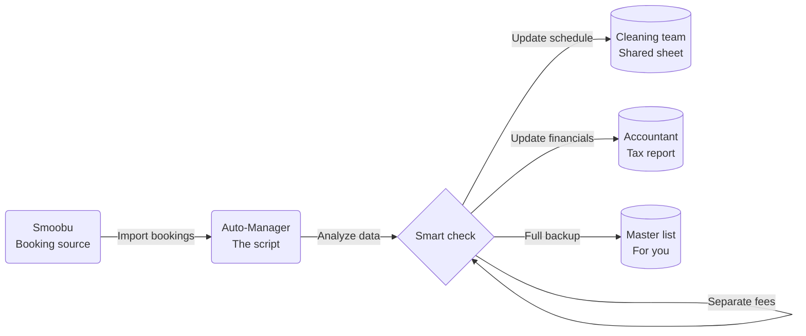

Stop copying and pasting reservation data. This script runs in the background of your Google Spreadsheet, connects to Smoobu every hour, and automatically updates three views of your booking data: one for your cleaning team, one for your accountant, one master list for you.

---

## Why it exists

As a short-term rental host, you need the same reservation data in different shapes for different people. Your cleaner needs arrival/departure times and whether there's a dog. Your accountant only wants completed stays with fees separated out. You need everything.

The manual version is: export from Smoobu, paste into three sheets, remember to update when something cancels. The automated version is: set it up once, forget it.

---

## Key features

**Smart dog & baby detection** — guests often forget to tick the pet option but mention it in their message ("We're bringing two dogs"). The script reads the text notes and updates the dog count automatically so your cleaner isn't surprised.

**Cleaner communication** — updates a shared spreadsheet your cleaning team can access. Cancellations are removed instantly.

**Tax-ready reporting** — filters to only show bookings that have actually started (not future reservations), making year-end reporting cleaner.

**Fee separation** — automatically splits cleaning fees and host fees from the total price, giving you accurate income figures.

**European date formatting** — dates formatted correctly for German/European standards throughout.

---

---

## Quick setup

1. Get your Smoobu API key: Settings → External Integrations → API
2. Create two blank Google Sheets (cleaner view + accountant view), copy their IDs from the URL
3. Open your main Google Sheet → Extensions → Apps Script → paste the code
4. Fill in the `CONFIG` at the top with your key and sheet IDs
5. Click the "Smoobu Sync" menu button that appears

Set up a time-based trigger for hourly sync if you want it fully automated.
